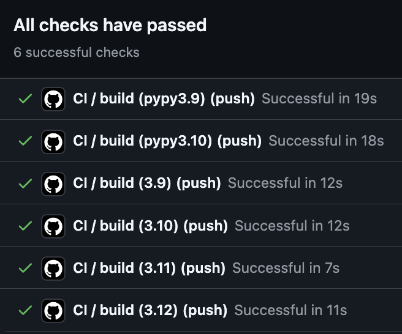

# Mu-Niu-Github-Actions-Matrix

# Overview
This project demonstrates setting up a GitHub Actions workflow to test Python code across multiple versions of Python. The repository uses a matrix strategy to ensure compatibility and testing efficiency across various Python environments.

# Features
* GitHub Actions Workflow: The workflow is configured to run tests across different versions of Python.
* Matrix Build: Tests the project in parallel on at least three different Python versions.
* Automated Testing: Ensures code quality and compatibility using automated tests defined in the repository.

# Requirements
* Python Versions: The project is tested against Python 3.7, 3.8, and 3.9.
* Dependencies: All dependencies required for the project are listed in the requirements.txt file.

# Project Structure
* main.py: Contains the main functionality of the project, a simple multiply function.
* test_main.py: Includes test cases to validate the functions in main.py.
* .github/workflows: Defines the GitHub Actions workflow that automates testing across different Python versions.
* requirements.txt: Specifies the required Python packages for the project.
* Makefile: Helps automate tasks such as setting up the environment, running tests, and more.

# Result

